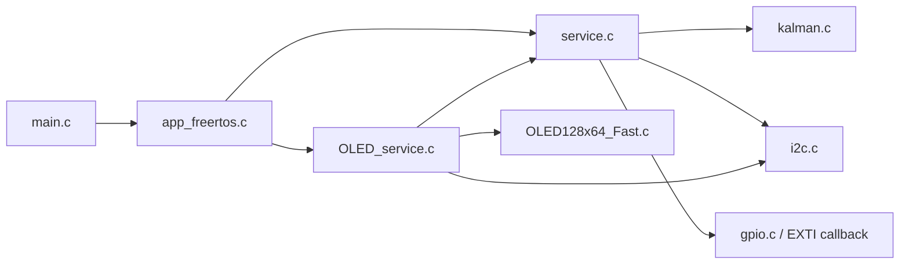
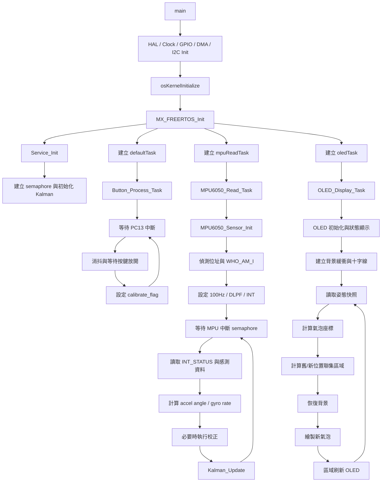

# testG431CBU6withMPU6050

這是一個以 `STM32G431CBU6` 為 MCU 的電子氣泡水平儀專案。系統透過 `MPU6050` / `MPU6500` 讀取加速度計與陀螺儀資料，使用一維 Kalman Filter 融合 X/Y 傾角，並將結果顯示在 `SSD1306` 相容的 `128x64 OLED` 上。

> 注意：實際感測器可能回應 `WHO_AM_I = 0x70` 或 `0x71`，因此模組可能是 `MPU6500` 或相容變體，而不一定是原廠 `MPU6050`。

## 目前功能

- `STM32CubeMX` 產生硬體與週邊初始化程式
- `FreeRTOS CMSIS-V2` 管理任務
- `I2C1` 連接 `MPU6050 / MPU6500`
- `I2C3` 連接 `OLED`
- `PC13` 作為校正按鍵
- `PC6` 作為校正時的狀態指示燈
- 開機時於 OLED 顯示系統狀態與 MPU 初始化結果
- 自動偵測 `0xD0` / `0xD2` 兩個感測器位址
- 設定感測器為 `100Hz` 採樣並啟用中斷
- 使用 Kalman Filter 融合 X/Y 姿態角
- 支援按鍵重新校正水平零點
- OLED 使用背景緩衝與區域刷新，只更新氣泡變動影響的聯集區域

## 系統架構

### 任務配置

- `defaultTask`
  呼叫 `Button_Process_Task()`，負責按鍵等待、消抖與校正請求
- `mpuReadTask`
  呼叫 `MPU6050_Read_Task()`，負責感測器初始化、資料讀取與 Kalman 更新
- `oledTask`
  呼叫 `OLED_Display_Task()`，負責 OLED 初始化、背景建立與氣泡顯示更新

### 模組分工

- `Core/Src/service.c`
  MPU 初始化、姿態估測、按鍵處理、服務狀態查詢
- `Core/Src/OLED_service.c`
  OLED 顯示邏輯、背景緩衝、氣泡繪製、區域刷新
- `Core/Src/kalman.c`
  一維 Kalman Filter 實作
- `Core/Src/app_freertos.c`
  FreeRTOS 任務建立與啟動

### 模組依賴圖



依賴關係說明：

- `app_freertos.c` 負責建立任務，分別進入 `service.c` 與 `OLED_service.c`
- `service.c` 負責 MPU、按鍵與姿態資料，並呼叫 `kalman.c`
- `OLED_service.c` 不直接碰姿態內部變數，而是透過 `service.h` 提供的查詢介面取值
- `OLED_service.c` 透過 `OLED128x64_Fast.c` 驅動 OLED，並使用 `i2c.c` 的 `hi2c3`

## 接線對照表

| 功能 | MCU 腳位 | 周邊/訊號 | 說明 |
| --- | --- | --- | --- |
| MPU I2C SCL | `PA15` | `I2C1_SCL` | 連接 `MPU6050 / MPU6500` 時脈線 |
| MPU I2C SDA | `PB7` | `I2C1_SDA` | 連接 `MPU6050 / MPU6500` 資料線 |
| MPU 中斷 | `PB14` | `MPUINT` | 感測器資料就緒中斷輸入 |
| OLED I2C SCL | `PA8` | `I2C3_SCL` | 連接 OLED 時脈線 |
| OLED I2C SDA | `PC11` | `I2C3_SDA` | 連接 OLED 資料線 |
| 校正按鍵 | `PC13` | `SW` | 上升沿中斷觸發校正請求 |
| 狀態指示燈 | `PC6` | `IND` | 校正執行期間點亮 |

> 實際接線時，`MPU6050 / MPU6500` 與 OLED 仍需另外接妥 `VCC` 與 `GND`。若 I2C 模組板上沒有內建上拉，需補上適當的 `SCL/SDA` 上拉電阻。

## 程式流程圖



## 顯示流程

`OLED_Display_Task()` 啟動後會：

1. 初始化 OLED 並顯示開機訊息
2. 建立 128x64 顯示緩衝與背景緩衝
3. 畫出十字基準線並保存為靜態背景
4. 依照目前姿態角與校正零點計算氣泡位置
5. 以舊位置與新位置的聯集矩形做背景恢復與區域刷新

目前顯示更新週期約為 `30 ms` 一次，氣泡位置直接由角度映射，不再額外做顯示平滑。

## 感測流程

`MPU6050_Read_Task()` 啟動後會：

1. 偵測感測器位址與 `WHO_AM_I`
2. 重置並喚醒感測器
3. 設定採樣率、DLPF 與中斷輸出
4. 等待 MPU 中斷 semaphore
5. 讀取 `INT_STATUS` 與 14-byte 感測資料
6. 由加速度計推算傾角、由陀螺儀推算角速度
7. 執行校正邏輯並更新 Kalman 狀態

## 主要檔案

- `Core/Inc/service.h`
  MPU 讀取、按鍵處理與服務狀態查詢介面
- `Core/Inc/OLED_service.h`
  OLED 顯示任務介面
- `Core/Inc/kalman.h`
  Kalman 結構與 API
- `Core/OLED_128x64/OLED128x64_Fast.c`
  OLED 基礎驅動
- `Core/OLED_128x64/OLED128x64_Fast.h`
  OLED 驅動宣告
- `testG431CBU6withMPU6050.ioc`
  STM32CubeMX 專案設定
- `CMakeLists.txt`
  CMake 建置入口

## Kalman 參數

目前初始化設定如下：

```c
Kalman_Init(&kalmanX, 0.005f, 0.003f, 0.005f);
Kalman_Init(&kalmanY, 0.005f, 0.003f, 0.005f);
```

這組參數偏向較靈敏的反應。若靜止時顯示抖動過大，可優先調高 `R_measure`；若慢速傾斜反應不足，可嘗試提高 `Q_angle` 或降低 `R_measure`。

## 硬體設定摘要

根據目前程式與 CubeMX 設定：

- MCU：`STM32G431CBU6`
- `I2C1`：連接 `MPU6050 / MPU6500`
- `I2C3`：連接 `OLED`
- `USART2`：保留作為序列埠
- `FreeRTOS`：CMSIS-V2
- `DMA1 Channel1`：`I2C1_RX`
- `DMA1 Channel2`：`I2C3_TX`

## 建置方式

本專案可由 CubeMX / CubeIDE 維護，也可透過 CMake 建置。

### CMake

專案根目錄提供：

- `CMakeLists.txt`
- `CMakePresets.json`
- `cmake/gcc-arm-none-eabi.cmake`
- `cmake/stm32cubemx/CMakeLists.txt`

常見流程如下：

```bash
cmake --preset Debug
cmake --build --preset Debug
```

或：

```bash
cmake --preset Release
cmake --build --preset Release
```

## 目前狀態說明

- OLED 顯示邏輯已從 `service.c` 拆分到獨立的 `OLED_service.c/.h`
- `service.c` 現在專注在 MPU、按鍵與服務資料提供
- README 已移除舊版中關於顯示平滑、OLED 仍位於 `service.c`、以及與目前程式不一致的描述

## 後續可優化方向

- 為 MPU DMA 讀取流程補上更完整的同步與錯誤處理
- 在 OLED 顯示更新中加入「座標未變時跳過刷新」的判斷
- 將感測器與顯示參數集中管理，便於後續調校
- 增加 UART 診斷輸出，方便觀察角度、零點與感測器狀態
